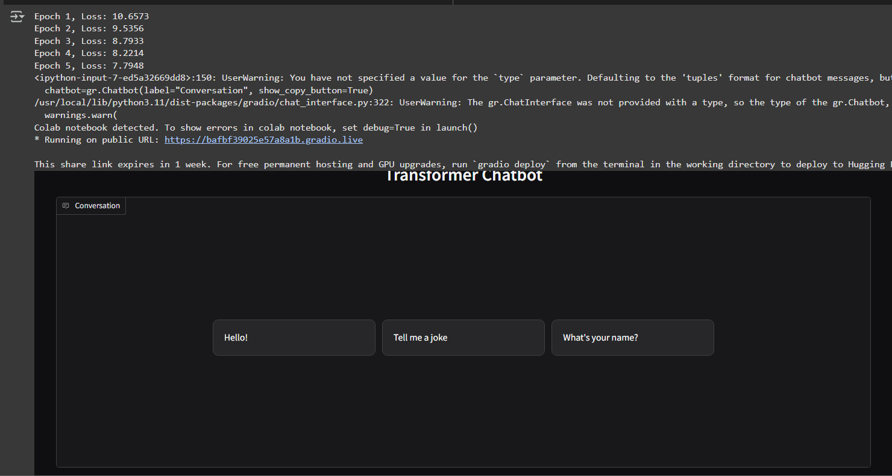
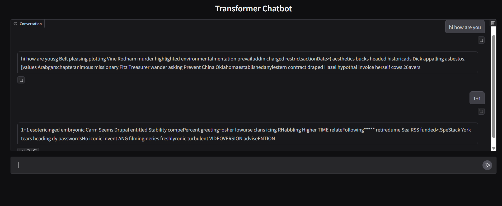

# tranformer_from_scratch
I have built Transformer Implementation from Scratch
# Transformer Chatbot

A PyTorch implementation of a Transformer-based chatbot with encoder-decoder architecture, trained from scratch.

 <!-- Add a demo gif if available -->

## Features

- Pure PyTorch implementation of Transformer architecture
- Custom tokenizer integration
- Training and inference scripts
- Gradio web interface for interactive chatting
- Support for both CPU and GPU training

## Requirements

- Python 3.8+
- PyTorch 1.12+
- Transformers 4.25+
- Gradio 3.0+
- Datasets (optional) 2.8+

## Installation

1. Clone the repository:
```bash
git clone https://github.com/jnvw/transformer_from_scratch.git
```
